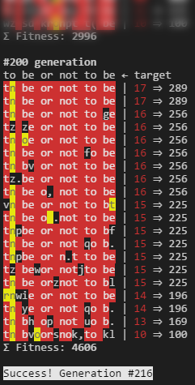

# Simple Genetic Algorithm
Using Genetic Algorithms to find an arbitrary sentance. 
Console app written in Node.js.

# Useful resources
* [The Nature of Code by Daniel Shiffman, Chapter 9. The Evolution of Code](http://natureofcode.com/book/chapter-9-the-evolution-of-code/)
* [9.x: Genetic Algorithms and Evolutionary Computing - The Nature of Code](https://youtu.be/6l6b78Y4V7Y)
